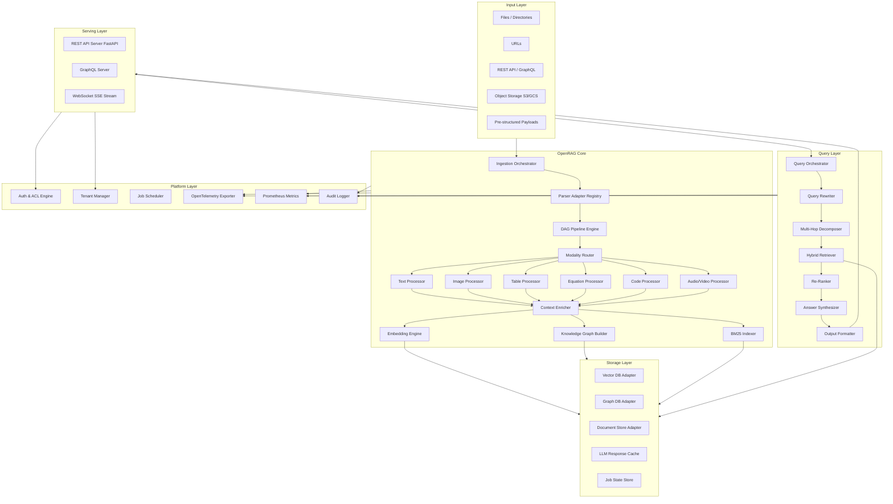

# Technical Architecture Document (TAD)
## OpenRAG: Open-Source Universal Knowledge Intelligence Framework

| Field | Details |
|---|---|
| **Document Version** | 1.0 |
| **Date** | March 2026 |
| **Framework** | OpenRAG |
| **Language** | Python ≥ 3.10 |
| **License** | Apache 2.0 |

---

## 1. Architectural Philosophy

OpenRAG is designed around five core architectural principles:

1. **Adapter-first** — Every external dependency (storage, LLM, vector DB, parser, ASR) is accessed through a registered adapter interface. No concrete implementation is baked into the core.
2. **DAG-native pipelines** — Ingestion and processing are modeled as Directed Acyclic Graphs. Processors with no mutual dependency execute in parallel; dependent processors are sequenced automatically.
3. **Schema-driven knowledge** — All stored knowledge carries a rich provenance schema: document ID, chunk ID, page, block index, modality type, confidence score, timestamps, and ACL tags.
4. **API-first** — The REST + GraphQL server is a first-class deliverable, not bolted on. The SDK and the server share the same internal service architecture.
5. **Observable by default** — OpenTelemetry spans, structured logs, and Prometheus metrics are emitted for every pipeline stage without any configuration.

---

## 2. System Architecture Overview



---

## 3. Module Breakdown

### 3.1 Ingestion Orchestrator

**File:** `openrag/ingestion/orchestrator.py`

The Ingestion Orchestrator is the entry point for all document ingestion. It is responsible for:

1. **Job lifecycle management** — creating, tracking, pausing, resuming, and cancelling ingestion jobs
2. **Deduplication** — computing content hashes (SHA-256) for incoming documents and skipping previously indexed content unless `force=True`
3. **Routing** — dispatching each document to the appropriate parser adapter based on file extension and MIME type
4. **Error handling** — wrapping each document ingestion in a retry policy with configurable exponential backoff
5. **Batch coordination** — managing `asyncio.Semaphore` or `ProcessPoolExecutor` for configurable parallelism

```python
class IngestionOrchestrator:
    def __init__(self, config: OpenRAGConfig, adapter_registry: AdapterRegistry)
    async def ingest_file(self, path: str, metadata: IngestMetadata) -> JobResult
    async def ingest_batch(self, paths: List[str], options: BatchOptions) -> BatchJobResult
    async def ingest_url(self, url: str, metadata: IngestMetadata) -> JobResult
    async def ingest_payload(self, payload: ContentPayload) -> JobResult
    def get_job_status(self, job_id: str) -> JobStatus
    async def cancel_job(self, job_id: str) -> bool
```

**Job State Schema:**

```json
{
  "job_id": "uuid",
  "status": "pending | running | paused | completed | failed",
  "document_hash": "sha256_hex",
  "tenant_id": "string",
  "file_path": "string",
  "created_at": "iso8601",
  "updated_at": "iso8601",
  "retry_count": 0,
  "error": null
}
```

---

### 3.2 Parser Adapter Registry

**File:** `openrag/parsers/registry.py`

This module implements the **Parser Adapter Pattern**. All document parsers are registered against a MIME type or file extension mapping.

#### Interface

```python
class BaseParserAdapter(ABC):
    @abstractmethod
    async def parse(self, file_path: str, options: ParseOptions) -> ContentPayload:
        """Returns a structured ContentPayload with typed content blocks."""

    @abstractmethod
    def supported_types(self) -> List[str]:
        """Returns list of supported MIME types or extensions."""

    @classmethod
    def health_check(cls) -> bool:
        """Returns True if the parser backend is available."""
```

#### Built-in Adapters (v1.0)

| Adapter | Class | Best For |
|---|---|---|
| **DoclingAdapter** | `DoclingParserAdapter` | Office docs, HTML, structured PDFs |
| **PDFMinerAdapter** | `PDFMinerParserAdapter` | Dense text PDFs, financial reports |
| **PyMuPDFAdapter** | `PyMuPDFParserAdapter` | High-fidelity PDF rendering + image extraction |
| **WhisperAdapter** | `WhisperParserAdapter` | Audio (MP3, WAV, M4A) → transcript |
| **FFmpegAdapter** | `FFmpegParserAdapter` | Video (MP4/MKV) → transcript + key frames |
| **BeautifulSoupAdapter** | `HTMLParserAdapter` | Web page ingestion |
| **TreeSitterAdapter** | `CodeParserAdapter` | Source code files (AST-aware splitting) |

#### ContentPayload (normalized output from all parsers)

```python
@dataclass
class ContentPayload:
    document_id: str          # Stable UUID derived from content hash
    source_path: str          # Original file path or URL
    metadata: DocumentMeta    # title, author, page_count, language, etc.
    blocks: List[ContentBlock]

@dataclass
class ContentBlock:
    block_id: str
    block_type: BlockType     # TEXT | IMAGE | TABLE | EQUATION | CODE | AUDIO_TRANSCRIPT
    page_number: Optional[int]
    sequence_index: int       # Order within document
    raw_content: Any          # Type-specific: str, bytes, dict
    bounding_box: Optional[BoundingBox]
    metadata: Dict[str, Any]  # Caption, footnote, language, etc.
```

---

### 3.3 DAG Pipeline Engine

**File:** `openrag/pipeline/dag_engine.py`

The DAG Pipeline Engine resolves processing tasks into an execution graph:

```
ParseStage ──► ModalityRouterStage ──► [TextProc, ImageProc, TableProc, EquationProc, CodeProc]
                                                        │  (parallel)
                                               ContextEnricherStage
                                                        │
                                       ┌────────────────┼────────────────┐
                                  EmbedStage        KGBuildStage     BM25IndexStage
                                       │                  │                │
                                  VectorDBWrite     GraphDBWrite     SearchIndexWrite
```

Processors within a stage with no inter-dependencies are scheduled concurrently via `asyncio.gather`. The engine supports:

- **Stage-level timeouts** — configurable per-stage maximum execution time
- **Conditional branches** — skip a processor if content type is not present
- **Custom hook points** — `before_stage` and `after_stage` callbacks for instrumentation
- **YAML serialization** — the full DAG definition is declaratively representable in YAML

---

### 3.4 Modality Processor Suite

**Base class:** `openrag/processors/base.py`

#### Interface

```python
class BaseModalityProcessor(ABC):
    @abstractmethod
    async def process(
        self,
        block: ContentBlock,
        context: ProcessingContext,
    ) -> ProcessedBlock:
        """Process a single content block and return enriched result."""

    @abstractmethod
    def supported_block_types(self) -> List[BlockType]:
        """Returns block types this processor handles."""
```

**`ProcessingContext`** carries:
- The surrounding `ContentPayload` for context window extraction
- The configured LLM and VLM callable functions
- The `ContextWindowConfig` (window size, max tokens, mode)
- Tenant configuration and metadata

**`ProcessedBlock`** carries:
- `natural_language_description` — the semantic description generated by the AI model
- `entity_candidates` — extracted named entities with types
- `embedding_text` — the text string to be embedded
- `structured_data` — optional structured representation (e.g., table as a list of dicts)
- `confidence_score` — model confidence in the description (0.0–1.0)
- original `ContentBlock` reference

#### Modality Processors

##### `TextProcessor`
- Responsible for: semantic chunking of text blocks using a configurable splitter (sentence, token, or paragraph)
- **Context enrichment:** adjacent heading-level blocks are prepended to each chunk
- **Chunking strategies:** `SentenceSplitter`, `TokenSplitter`, `RecursiveCharacterSplitter`, `SemanticSplitter`

##### `ImageProcessor`
- Encodes image bytes to base64
- Calls VLM with a structured prompt requesting: visual description, scene composition, embedded text (OCR), bounding-box entity tags, and a one-line summary
- Extracts embedded text (if any) using the VLM's OCR capability
- Returns `ProcessedBlock` with full VLM response and entity_candidates

##### `TableProcessor`
- Detects table format (HTML, Markdown, CSV, proprietary)
- Normalizes to a `DataFrame`-compatible structure (column names + rows)
- Calls LLM with: table schema, sample rows, and caption → produces a natural language summary and domain tagging
- Extracts numeric trends (min, max, mean) for each numeric column as structured metadata

##### `EquationProcessor`
- Parses LaTeX (primary) or MathML (fallback) using `sympy` for symbolic simplification
- Calls LLM with simplified form + surrounding text context → produces: English interpretation, variable definitions, and domain classification (physics, statistics, finance, etc.)
- Cross-references domain tags to existing knowledge graph entities

##### `CodeProcessor`
- Uses `tree-sitter` for language-aware AST parsing → extracts: function names, classes, imports, docstrings
- Calls code-aware LLM model with function body + docstring → produces semantic intent description
- Registers each function/class as a distinct named entity in the knowledge graph with typed edges (`defines`, `imports`, `calls`)

##### `AudioVideoProcessor`
- Delegates to the configured ASR adapter (Whisper by default) → produces a timestamped transcript
- For video: delegates to `FFmpegAdapter` to extract key frames at configurable intervals
- Each key frame is passed to `ImageProcessor` as a sub-block
- Transcript segments are aligned with key frames for coherent retrieval

---

### 3.5 Context Enricher

**File:** `openrag/pipeline/context_enricher.py`

The Context Enricher provides each modal processor with surrounding document context before it calls the AI model.

**Strategy options (configurable per pipeline):**

| Strategy | Description |
|---|---|
| `page_window` | Include text blocks from `current_page ± N` pages |
| `block_window` | Include `N` blocks before and after the current block by sequence index |
| `section_ancestor` | Traverse document hierarchy upward to include ancestor section headings |
| `semantic_neighbour` | Use a fast embedding model to find the top-K most semantically related text blocks |

**Token budget enforcement:** Context is truncated to `max_context_tokens` using the configured tokenizer with sentence-boundary-aware trimming.

---

### 3.6 Embedding Engine

**File:** `openrag/embeddings/engine.py`

```python
class EmbeddingEngine:
    def __init__(self, adapter: BaseEmbeddingAdapter, batch_size: int, cache: EmbeddingCache)
    async def embed_blocks(self, blocks: List[ProcessedBlock]) -> List[EmbeddedBlock]
    async def embed_query(self, text: str) -> np.ndarray
```

**Built-in Embedding Adapters:**

| Adapter | Supports |
|---|---|
| `OpenAIEmbeddingAdapter` | OpenAI `text-embedding-3-large`, `text-embedding-3-small` |
| `CohereEmbeddingAdapter` | Cohere Embed v3 |
| `HuggingFaceEmbeddingAdapter` | Any HuggingFace Sentence Transformers model |
| `OllamaEmbeddingAdapter` | Locally-hosted Ollama embedding models |

**Embedding Cache:** Embeddings are cached by content hash to avoid redundant API calls on re-ingestion. Cache backend is configurable (in-memory, Redis, SQLite).

---

### 3.7 Knowledge Graph Builder

**File:** `openrag/knowledge/graph_builder.py`

The Knowledge Graph Builder extracts entities and relationships from `ProcessedBlock` results and writes them to the configured graph database adapter.

#### Entity Extraction Pipeline

```
ProcessedBlock.natural_language_description
        │
        ▼
  Entity Extractor (LLM-based NER)
        │
        ▼
  Entity Resolution (deduplication + coreference)
        │
        ▼
  Relationship Extractor (LLM-based RE)
        │
        ▼
  Cross-Modal Linker
        │
        ▼
  Graph DB Adapter Write
```

#### Graph Schema

**Node Types:**

| Type | Properties |
|---|---|
| `Document` | id, title, source_path, tenant_id, ingested_at |
| `Section` | id, title, level, document_id |
| `Chunk` | id, content, block_type, modality, page_number, embedding_id |
| `Entity` | id, name, type, description, canonical_name |

**Edge Types (typed, weighted):**

| Edge | Source → Target | Description |
|---|---|---|
| `CONTAINS` | Document → Section, Section → Chunk | Hierarchy |
| `NEXT` | Chunk → Chunk | Sequential ordering |
| `DEFINES` | Chunk(code) → Entity | Code defines a concept |
| `ILLUSTRATES` | Chunk(image) → Entity | Image visually represents entity |
| `REFERENCES` | Entity → Entity | Cross-reference between concepts |
| `CITES` | Document → Document | Citation relationship |
| `PROVES` | Chunk(equation) → Entity | Mathematical proof of concept |
| `IMPLEMENTS` | Chunk(code) → Entity | Code implements an algorithm |

---

### 3.8 BM25 Indexer

**File:** `openrag/search/bm25_indexer.py`

Maintains an inverted index for sparse keyword retrieval alongside the dense vector index. Implemented using `rank_bm25` or pluggable via an Elasticsearch/OpenSearch adapter.

**Index schema per tenant:** Tokenized text per chunk, stored in the Document Store Adapter alongside document and chunk metadata.

---

### 3.9 Storage Adapter Layer

**File:** `openrag/storage/`

All storage is accessed through pluggable adapters registered in the `AdapterRegistry`.

#### Vector DB Adapters

```python
class BaseVectorDBAdapter(ABC):
    async def upsert(self, namespace: str, records: List[VectorRecord]) -> None
    async def query(self, namespace: str, vector: np.ndarray, top_k: int, filters: Dict) -> List[SearchResult]
    async def delete(self, namespace: str, ids: List[str]) -> None
```

| Adapter | Backend |
|---|---|
| `QdrantAdapter` | Qdrant |
| `WeaviateAdapter` | Weaviate |
| `ChromaAdapter` | ChromaDB |
| `PgVectorAdapter` | PostgreSQL + pgvector |
| `PineconeAdapter` | Pinecone |
| `InMemoryVectorAdapter` | In-process (dev/test) |

#### Graph DB Adapters

```python
class BaseGraphDBAdapter(ABC):
    async def upsert_node(self, node: GraphNode) -> None
    async def upsert_edge(self, edge: GraphEdge) -> None
    async def traverse(self, start_node_id: str, depth: int, edge_types: List[str]) -> SubGraph
    async def find_nodes(self, filters: NodeFilter) -> List[GraphNode]
```

| Adapter | Backend |
|---|---|
| `Neo4jAdapter` | Neo4j |
| `ArangoDBAdapter` | ArangoDB |
| `NetworkXAdapter` | NetworkX (in-memory, dev/test) |

#### Document Store Adapters

| Adapter | Backend |
|---|---|
| `PostgreSQLDocumentAdapter` | PostgreSQL |
| `MongoDBDocumentAdapter` | MongoDB |
| `SQLiteDocumentAdapter` | SQLite (dev/test) |

---

### 3.10 Query Orchestrator & Intelligence

**File:** `openrag/query/`

#### Query Lifecycle

```
User Query String
        │
        ▼
   QueryRequest (parsed, validated)
        │
        ├─► Auth & ACL check (filter by tenant + identity)
        │
        ▼
   QueryRewriter (optional)
        │   - Spelling correction
        │   - Synonym expansion
        │   - HyDE (generate hypothetical document for embedding)
        │
        ▼
   MultiHopDecomposer (optional)
        │   - LLM decomposes complex question → sub-queries
        │   - Each sub-query resolved independently
        │
        ▼
   HybridRetriever
        ├─► DenseRetriever  (embed query → vector search)
        ├─► SparseRetriever (BM25 keyword match)
        └─► GraphRetriever  (entity-anchor KG traversal)
               │
               └─► RRF Fusion (Reciprocal Rank Fusion of all 3 result lists)
        │
        ▼
   CrossEncoderReRanker (optional)
        │   - Re-scores top-K candidates with a cross-encoder model
        │
        ▼
   ContextAssembler
        │   - Assembles final context window from re-ranked chunks
        │   - Deduplicates overlapping chunks
        │   - Respects max_context_tokens budget
        │
        ▼
   AnswerSynthesizer
        │   - Calls configured LLM with assembled context + query prompt
        │   - Injects structured output schema if provided
        │   - Supports function-calling tool invocation
        │
        ▼
   OutputFormatter
        │   - Attaches citations (doc_id, page, block_id, modality)
        │   - Formats as streaming tokens (SSE/WS) or full response JSON
        │
        ▼
  QueryResponse
```

#### Query Strategy Modes

| Mode | Retriever Used | Description |
|---|---|---|
| `dense` | DenseRetriever only | Pure semantic vector search |
| `sparse` | SparseRetriever only | Keyword/BM25 search |
| `graph` | GraphRetriever only | Knowledge graph traversal from entity anchors |
| `hybrid` | Dense + Sparse → RRF fusion | Best for general queries |
| [multimodal](file:///Users/nareshsingh/MEGA-P/dev/RAG-Anything-main/raganything/query.py#825-850) | Dense + Graph + VLM inline | Retrieves context + loads images for VLM |

#### Structured Output Mode

When `output_schema` is provided in the query request, the Answer Synthesizer adds a structured output instruction to the LLM prompt and validates the response against the schema using `jsonschema`. On validation failure, it retries up to `N` times with the validation error fed back to the LLM.

#### Function Calling

Tools are registered at the namespace level:

```python
@openrag.tool(name="get_stock_price", description="...")
async def get_stock_price(ticker: str) -> float:
    ...
```

During answer synthesis, the LLM may invoke registered tools. The orchestrator intercepts tool call events, executes the function, returns the result to the LLM, and allows the generation to continue.

#### Conversational Memory

Each query session is assigned a `session_id`. The `SessionMemoryManager` maintains a rolling window of the last `N` turns (configurable). Previous turns are summarized by the LLM when the window budget is exceeded, and the summary is carried forward.

---

### 3.11 API Server

**File:** `openrag/server/`

The built-in server is built with **FastAPI** and uses `uvicorn` for ASGI serving.

#### REST Endpoints

| Method | Path | Description |
|---|---|---|
| `POST` | `/v1/ingest` | Submit a file, URL, or payload for ingestion |
| `POST` | `/v1/ingest/batch` | Submit a batch of paths or URLs |
| `GET` | `/v1/jobs/{job_id}` | Get ingestion job status |
| `DELETE` | `/v1/jobs/{job_id}` | Cancel an ingestion job |
| `POST` | `/v1/query` | Submit a query (returns full response) |
| `GET` | `/v1/query/stream` | Submit a query with SSE streaming |
| `GET` | `/v1/namespaces` | List all tenant namespaces |
| `POST` | `/v1/namespaces` | Create a namespace |
| `GET` | `/v1/documents` | List documents in namespace |
| `DELETE` | `/v1/documents/{doc_id}` | Delete a document |
| `GET` | `/health` | Component health check |
| `GET` | `/metrics` | Prometheus metrics |
| `GET` | `/docs` | OpenAPI Swagger UI |

#### GraphQL Schema (excerpt)

```graphql
type Query {
  query(
    text: String!
    mode: QueryMode = HYBRID
    namespace: String!
    top_k: Int = 10
    output_schema: JSON
    session_id: String
  ): QueryResponse!

  documents(namespace: String!, filters: DocumentFilter): [Document!]!
}

type Mutation {
  ingest(input: IngestInput!): Job!
  createNamespace(name: String!, config: NamespaceConfig): Namespace!
  deleteDocument(id: ID!, namespace: String!): Boolean!
}

type Subscription {
  queryStream(requestId: String!): QueryToken!
}
```

#### WebSocket Protocol

```
Client: {"type": "query", "text": "...", "mode": "hybrid", "namespace": "..."}
Server: {"type": "token", "token": "The "}
Server: {"type": "token", "token": "answer "}
...
Server: {"type": "done", "citations": [...], "metadata": {...}}
```

---

### 3.12 Authentication & Access Control Engine

**File:** `openrag/auth/`

#### Identity Model

Every request carries an identity resolved from:
1. `Authorization: Bearer <JWT>` header (for service integrations)
2. `X-API-Key: <key>` header (for developer access)

JWT claims include: `sub` (user ID), `tenant_id`, `roles[]`.

#### Namespace Isolation

All storage adapters are namespaced. A query against namespace `legal-team` can only access vectors, graph nodes, and documents tagged with `tenant_id=legal-team`. Cross-namespace queries require explicit superadmin permissions.

#### Document ACLs

Each document carries an `acl` field:

```json
{
  "acl": {
    "read": ["role:attorneys", "user:alice@example.com"],
    "write": ["role:admins"]
  }
}
```

At query time, the `ACLFilter` injects visibility filters into every vector and graph retrieval call, ensuring results are pre-filtered before the LLM sees them.

---

### 3.13 Observability Stack

**File:** `openrag/observability/`

#### OpenTelemetry Tracing

Every pipeline stage and query operation creates a span:

| Span Name | Attributes |
|---|---|
| `openrag.ingest.parse` | `document_id`, `parser_type`, `file_type`, `tenant_id` |
| `openrag.ingest.process.image` | `block_id`, `page_number`, `model_name` |
| `openrag.ingest.embed` | `block_count`, `model_name`, `latency_ms` |
| `openrag.query.retrieve` | `mode`, `top_k`, `namespace`, `results_count` |
| `openrag.query.synthesize` | `model_name`, `prompt_tokens`, `completion_tokens`, `latency_ms` |

#### Prometheus Metrics

| Metric | Type | Labels |
|---|---|---|
| `openrag_ingest_documents_total` | Counter | `tenant`, `parser`, `status` |
| `openrag_ingest_blocks_total` | Counter | `tenant`, `block_type`, `status` |
| `openrag_query_requests_total` | Counter | `tenant`, `mode`, `status` |
| `openrag_query_latency_seconds` | Histogram | `tenant`, `mode` |
| `openrag_embedding_latency_seconds` | Histogram | `model` |
| `openrag_llm_tokens_total` | Counter | `tenant`, `model`, `type` |
| `openrag_vector_db_query_latency_seconds` | Histogram | `adapter` |

#### Structured Audit Log

All data access events are written to the audit log:

```json
{
  "event": "query.executed",
  "tenant_id": "legal-team",
  "user_id": "alice",
  "query_text_hash": "sha256_hex",
  "mode": "hybrid",
  "documents_accessed": ["doc_abc123", "doc_def456"],
  "modalities_accessed": ["text", "table"],
  "timestamp": "2026-03-18T14:50:00Z",
  "latency_ms": 1240
}
```

---

## 4. Declarative YAML Pipeline Configuration

OpenRAG ingestion and query pipelines can be fully configured via YAML:

```yaml
openrag:
  version: "1.0"
  namespace: "research-papers"
  tenant_id: "university-lab"

parsers:
  pdf: pymupdf
  docx: docling
  audio: whisper
  code: treesitter

processors:
  text:
    enabled: true
    chunking_strategy: semantic
    chunk_size_tokens: 512
    chunk_overlap_tokens: 64
  image:
    enabled: true
    vlm_model: gpt-4o
    extract_ocr: true
    bounding_box_entities: true
  table:
    enabled: true
    formats: [markdown, html, csv]
    extract_numeric_trends: true
  equation:
    enabled: true
    input_format: latex
    symbolic_simplify: true
  code:
    enabled: true
    languages: [python, javascript, sql, go]
    extract_functions: true
  audio_video:
    enabled: true
    asr_model: whisper-large-v3
    keyframe_interval_seconds: 30

context:
  strategy: section_ancestor
  window_size: 2
  max_tokens: 1500
  include_captions: true

embedding:
  provider: openai
  model: text-embedding-3-large
  dimensions: 3072
  batch_size: 100

knowledge_graph:
  enabled: true
  adapter: neo4j
  extract_entity_types: [PERSON, ORG, CONCEPT, EQUATION, ALGORITHM, DATASET]
  relationship_extraction: true
  cross_modal_linking: true

vector_db:
  adapter: qdrant
  collection: research_chunks
  distance_metric: cosine

document_store:
  adapter: postgresql
  schema: openrag

retrieval:
  default_mode: hybrid
  top_k: 20
  reranker:
    enabled: true
    model: cross-encoder/ms-marco-MiniLM-L-6-v2

llm:
  provider: openai
  model: gpt-4o-mini
  temperature: 0.1
  max_output_tokens: 2048

api_server:
  host: "0.0.0.0"
  port: 8000
  cors_origins: ["*"]
  rate_limit_per_minute: 60
  auth_mode: api_key

observability:
  tracing:
    enabled: true
    exporter: otlp
    endpoint: "http://otel-collector:4317"
  metrics:
    enabled: true
    port: 9090
  audit_log:
    enabled: true
    destination: structured_json
```

---

## 5. Hybrid Retrieval — Technical Detail

OpenRAG's `HybridRetriever` combines three retrieval signals using **Reciprocal Rank Fusion (RRF)**:

```
RRF_score(d) = Σ 1 / (k + rank_i(d))
```

Where `k=60` (default, configurable) and `rank_i` is the rank of document `d` in retrieval list `i`.

```
DenseResults   : [(doc_A, 0.95), (doc_B, 0.91), (doc_C, 0.88)]
SparseResults  : [(doc_B, 12.3), (doc_D, 11.1), (doc_A, 10.8)]
GraphResults   : [(doc_A, 8.2),  (doc_C, 7.1),  (doc_E, 6.9)]
                                 │
                          RRF Fusion
                                 │
FusedResults   : [(doc_A, 0.048), (doc_B, 0.041), (doc_C, 0.035), ...]
```

**ACL filters** are applied inside each retrieval leg as server-side predicates passed to the storage adapter, ensuring the LLM never receives unauthorized context.

---

## 6. Data Flow: Full Ingestion Lifecycle

```
1. Client sends POST /v1/ingest with file "research.pdf"
2. Auth engine validates API key → resolves tenant + identity
3. IngestionOrchestrator creates Job (UUID), stores in Job State Store
4. Content hash computed → dedup check against Document Store
5. PyMuPDFAdapter.parse() invoked:
   - Extracts text blocks, image blocks, table blocks, equation blocks
   - Returns ContentPayload with 47 ContentBlocks
6. DAG Pipeline Engine builds execution graph:
   - Stage 1: ContextEnricher (sequential, needs full payload)
   - Stage 2: [TextProcessor, ImageProcessor, TableProcessor, EquationProcessor] (parallel)
   - Stage 3: [EmbeddingEngine, KGBuilder, BM25Indexer] (parallel, depend on Stage 2)
7. TextProcessor: semantic chunking → 23 ProcessedBlocks
8. ImageProcessor (8 image blocks): VLM captions → 8 ProcessedBlocks
9. TableProcessor (4 table blocks): schema + summary → 4 ProcessedBlocks
10. EquationProcessor (6 equation blocks): LaTeX parse → 6 ProcessedBlocks
11. EmbeddingEngine: batch-embeds all 41 ProcessedBlocks → write to QdrantAdapter
12. KGBuilder: NER + RE → upsert 134 entities + 89 edges to Neo4jAdapter
13. BM25Indexer: indexes text of all blocks → write to PostgreSQLDocumentAdapter
14. Job status updated to "completed"
15. OTel span closed; Prometheus counters incremented
```

---

## 7. Deployment Architecture

### 7.1 Single-Process Development Mode

```bash
openrag serve --config pipeline.yaml --dev
# Starts FastAPI server with in-memory vector DB, NetworkX graph, SQLite document store
```

### 7.2 Docker Compose Production Reference

```
┌─────────────────────────────────────────────────────────────────┐
│  Docker Compose Stack                                           │
│                                                                 │
│  ┌──────────────────┐    ┌──────────────────┐                  │
│  │  openrag-api     │    │  openrag-worker  │                  │
│  │  (FastAPI)       │    │  (background     │                  │
│  │  Port 8000       │    │   ingestion)     │                  │
│  └────────┬─────────┘    └────────┬─────────┘                  │
│           │                       │                             │
│  ┌────────▼───────────────────────▼────────┐                   │
│  │            Redis (job queue + cache)     │                   │
│  └──────────────────────────────────────────┘                  │
│  ┌──────────────┐ ┌──────────────┐ ┌────────────────┐         │
│  │  Qdrant      │ │  Neo4j       │ │  PostgreSQL     │         │
│  │  (vector DB) │ │  (graph DB)  │ │  (doc store)    │         │
│  └──────────────┘ └──────────────┘ └────────────────┘         │
│  ┌──────────────────────────────────────────────────┐          │
│  │  OpenTelemetry Collector → Jaeger                │          │
│  │  Prometheus → Grafana                            │          │
│  └──────────────────────────────────────────────────┘          │
└─────────────────────────────────────────────────────────────────┘
```

### 7.3 Kubernetes Deployment

A Helm chart provides:
- `openrag-api` Deployment (horizontally scalable, HPA by CPU/RPS)
- `openrag-worker` Deployment (scales by job queue depth)
- `openrag-api` Service + Ingress
- `ConfigMap` for `pipeline.yaml`
- `Secret` for API keys
- `ServiceMonitor` for Prometheus scraping
- `PodDisruptionBudget` for rolling updates

---

## 8. Project Structure

```
openrag/
├── openrag/                        # Main Python package
│   ├── __init__.py                 # Public SDK surface
│   ├── config.py                   # OpenRAGConfig dataclass + YAML loader
│   ├── ingestion/
│   │   ├── orchestrator.py         # IngestionOrchestrator
│   │   ├── deduplicator.py         # Content hash deduplication
│   │   └── job_manager.py          # Job lifecycle (create, cancel, status)
│   ├── parsers/
│   │   ├── base.py                 # BaseParserAdapter ABC
│   │   ├── registry.py             # Adapter registration + MIME mapping
│   │   ├── docling_adapter.py
│   │   ├── pymupdf_adapter.py
│   │   ├── whisper_adapter.py
│   │   ├── ffmpeg_adapter.py
│   │   ├── html_adapter.py
│   │   └── code_adapter.py
│   ├── pipeline/
│   │   ├── dag_engine.py           # DAG-based pipeline executor
│   │   ├── context_enricher.py     # Multi-strategy context extraction
│   │   └── stage.py                # PipelineStage base class
│   ├── processors/
│   │   ├── base.py                 # BaseModalityProcessor ABC
│   │   ├── text_processor.py
│   │   ├── image_processor.py
│   │   ├── table_processor.py
│   │   ├── equation_processor.py
│   │   ├── code_processor.py
│   │   └── audio_video_processor.py
│   ├── embeddings/
│   │   ├── engine.py               # EmbeddingEngine
│   │   ├── cache.py                # Embedding cache
│   │   └── adapters/               # OpenAI, Cohere, HuggingFace, Ollama
│   ├── knowledge/
│   │   ├── graph_builder.py        # KG entity + edge construction
│   │   ├── entity_extractor.py     # LLM-based NER
│   │   ├── relationship_extractor.py
│   │   └── cross_modal_linker.py   # Cross-modal entity association
│   ├── search/
│   │   ├── bm25_indexer.py         # BM25 keyword index
│   │   └── rrf_fusion.py           # Reciprocal Rank Fusion
│   ├── storage/
│   │   ├── base.py                 # BaseVectorDBAdapter, BaseGraphDBAdapter, BaseDocStoreAdapter
│   │   ├── vector/                 # Qdrant, Weaviate, Chroma, PgVector, Pinecone, InMemory
│   │   ├── graph/                  # Neo4j, ArangoDB, NetworkX
│   │   └── document/               # PostgreSQL, MongoDB, SQLite
│   ├── query/
│   │   ├── orchestrator.py         # QueryOrchestrator (full lifecycle)
│   │   ├── rewriter.py             # Query rewriting + HyDE
│   │   ├── decomposer.py           # Multi-hop decomposition
│   │   ├── retriever.py            # HybridRetriever (dense + sparse + graph)
│   │   ├── reranker.py             # CrossEncoderReRanker
│   │   ├── assembler.py            # Context assembly + dedup
│   │   ├── synthesizer.py          # Answer synthesis + structured output + tool calls
│   │   ├── formatter.py            # Citation attachment + output formatting
│   │   └── session.py              # Conversational memory
│   ├── server/
│   │   ├── app.py                  # FastAPI application factory
│   │   ├── routes/                 # REST route handlers
│   │   ├── graphql/                # GraphQL schema + resolvers
│   │   └── websocket.py            # WebSocket/SSE streaming
│   ├── auth/
│   │   ├── engine.py               # JWT + API key resolution
│   │   ├── acl.py                  # Document ACL filter
│   │   └── tenant.py               # Namespace isolation
│   ├── observability/
│   │   ├── tracing.py              # OpenTelemetry span factory
│   │   ├── metrics.py              # Prometheus counter/histogram definitions
│   │   └── audit.py                # Structured audit event logger
│   └── cli/
│       └── main.py                 # openrag CLI (init, ingest, query, serve)
├── tests/                          # Unit + integration tests
├── examples/                       # Quickstart examples
├── helm/                           # Kubernetes Helm chart
├── docker/                         # Dockerfile + Docker Compose reference
├── docs/                           # Documentation site source
├── pipeline.example.yaml           # Reference pipeline YAML
├── pyproject.toml                  # Build config (PEP 517)
└── README.md
```

---

## 9. Extension Points

| Extension | Interface | Registration Method |
|---|---|---|
| **New parser backend** | `BaseParserAdapter` | `registry.register_parser("pdf", MyPDFAdapter)` |
| **New modality processor** | `BaseModalityProcessor` | `pipeline.register_processor("diagram", DiagramProcessor)` |
| **New vector DB** | `BaseVectorDBAdapter` | `config.vector_db.adapter = "my_adapter"` in YAML |
| **New graph DB** | `BaseGraphDBAdapter` | `config.knowledge_graph.adapter = "my_graph"` in YAML |
| **New embedding model** | `BaseEmbeddingAdapter` | `config.embedding.provider = "my_provider"` in YAML |
| **New LLM provider** | Callable conforming to `LLMCallable` signature | Passed to `OpenRAG(llm_func=...)` |
| **New retrieval strategy** | Subclass `BaseRetriever` | `retriever_registry.register("my_mode", MyRetriever)` |
| **Custom pipeline tool** | Decorated function via `@openrag.tool` | Auto-registered at namespace level |
| **Custom auth provider** | Implement `BaseAuthProvider` | `auth_registry.register(MyAuthProvider)` |

---

## 10. Technology Stack Summary

| Layer | Technology | Rationale |
|---|---|---|
| Language | Python ≥ 3.10 | Broad AI/ML ecosystem, async-native |
| Async runtime | `asyncio` + `uvloop` | High-throughput async I/O |
| API framework | `FastAPI` | OpenAPI auto-gen, native async, WebSocket |
| GraphQL | `Strawberry` | Pythonic, FastAPI-native GraphQL |
| Config | `pydantic-settings`, `PyYAML` | Type-safe config with env var override |
| DAG execution | Custom + `anyio.TaskGroup` | Lightweight, no heavy workflow engine needed |
| Parsing | `PyMuPDF`, `Docling`, `BeautifulSoup4` | Best-in-class format coverage |
| Code parsing | `tree-sitter` | Language-agnostic AST analysis |
| ASR | `openai-whisper` | State-of-the-art speech-to-text |
| Symbolic math | `sympy` | Equation simplification + CAS |
| BM25 | `rank-bm25` | Lightweight sparse retrieval |
| Hybrid fusion | Custom RRF (`numpy`) | No additional dependency |
| Embeddings | Provider-agnostic adapters | Avoid single-vendor lock-in |
| Vector DB | Provider-agnostic adapters | Pluggable |
| Graph DB | Provider-agnostic adapters | Pluggable |
| Auth | `python-jose`, `passlib` | JWT + API key |
| Tracing | `opentelemetry-sdk` | Vendor-neutral distributed tracing |
| Metrics | `prometheus-client` | Industry-standard metrics |
| Packaging | `uv` + `pyproject.toml` | Fast, modern Python packaging |
| Containerization | Docker + Helm | Cloud-native deployment |
